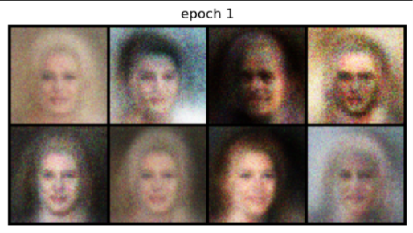
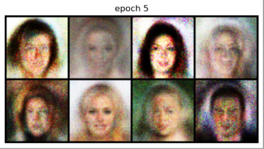
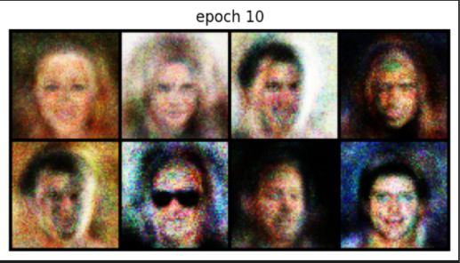

<div align="center">


<br/>

[](https://pytorch.org)
[](https://python.org)
[](https://developer.nvidia.com/cuda-toolkit)
[](https://mmlab.ie.cuhk.edu.hk/projects/CelebA.html)
[](LICENSE)
[](https://github.com/Abhay-coding/FaceForge-GAN/stargazers)

<br/>

<table>
<tr>
<td align="center" width="33%">

<br/><br/>
<kbd>🌫️ Epoch 1 — Pure Chaos</kbd>
</td>
<td align="center" width="33%">

<br/><br/>
<kbd>🧩 Epoch 5 — Taking Shape</kbd>
</td>
<td align="center" width="33%">

<br/><br/>
<kbd>🎭 Epoch 10 — Almost Human</kbd>
</td>
</tr>
</table>

<br/>

> ### *"Two neural networks walk into a bar — one tries to fake an ID, the other tries to catch it.*
> ### *After 10 rounds... nobody can tell the difference."*

<br/>

</div>

---

<div align="center">

## ✦ &nbsp; W H A T &nbsp; I S &nbsp; T H I S ? &nbsp; ✦

</div>

<br/>

A **Vanilla GAN (Generative Adversarial Network)** built from **absolute scratch** in PyTorch, trained on the **CelebA dataset** (202,599 real celebrity face images) to synthesize brand-new human faces that never existed.

No convolutions. No pre-trained weights. No shortcuts.

Just two fully-connected networks locked in a **zero-sum adversarial arms race** — a Generator that learns to forge faces from pure Gaussian noise, and a Discriminator that learns to expose the forgeries. They train together, each making the other sharper, until the Generator produces faces realistic enough to fool the Discriminator — and your eyes.

<br/>

---

<br/>

## 🏗️ Architecture

```
  ╔══════════════════════════════════════════╗
  ║        RANDOM NOISE  z ~ N(0,1)         ║
  ║              shape: (100,)               ║
  ╚════════════════════╦═════════════════════╝
                       ║
                       ▼
  ╔══════════════════════════════════════════╗
  ║             GENERATOR  (G)              ║
  ╠══════════════════════════════════════════╣
  ║  Linear(100  → 256)   + ReLU            ║
  ║  Linear(256  → 512)   + ReLU            ║
  ║  Linear(512  → 1024)  + ReLU            ║
  ║  Linear(1024 → 12288) + Tanh            ║
  ║  Reshape → (3, 64, 64)                  ║
  ╚════════════════════╦═════════════════════╝
                       ║
              [Fake Image 64×64]
                       ║
         ┌─────────────┴──────────────┐
         │                            │
         ▼                            ▼
  [Real Images]               [Fake Images]
  from CelebA                 from Generator
         │                            │
         └─────────────┬──────────────┘
                       ▼
  ╔══════════════════════════════════════════╗
  ║           DISCRIMINATOR  (D)            ║
  ╠══════════════════════════════════════════╣
  ║  Flatten → (12288,)                     ║
  ║  Linear(12288 → 1024) + LeakyReLU(0.2) ║
  ║  Linear(1024  → 512)  + LeakyReLU(0.2) ║
  ║  Linear(512   → 256)  + LeakyReLU(0.2) ║
  ║  Linear(256   → 1)    + Sigmoid         ║
  ╚════════════════════╦═════════════════════╝
                       ║
                       ▼
              Real (→1) / Fake (→0)
```

<br/>

---

<br/>

## 🧬 The Math Behind the Magic

The GAN objective is a **minimax two-player game**:

$$\min_G \max_D \; \mathbb{E}_{x \sim p_{data}}[\log D(x)] + \mathbb{E}_{z \sim p_z}[\log(1 - D(G(z)))]$$

In plain English:
- **D** wants to maximize its ability to tell real from fake → output `1` for real, `0` for fake
- **G** wants to minimize D's confidence → make fake images that D outputs `1` for
- At **Nash Equilibrium**, G produces perfect fakes and D is stuck guessing 50/50

<br/>

<div align="center">

| Component | Role | Output Activation | Why? |
|:---------:|:----:|:-----------------:|:----:|
| **Generator** | Forge fake faces from noise | `Tanh` → [-1, 1] | Matches normalized image range |
| **Discriminator** | Catch the forgeries | `Sigmoid` → [0, 1] | Outputs probability |
| **Loss** | `BCELoss` | — | Standard for binary classification |
| **Optimizer** | `Adam` (lr=0.0002, β₁=0.5) | — | Stable GAN training heuristic |

</div>

<br/>

---

<br/>

## 🗂️ Dataset — CelebA

<div align="center">

| Property | Details |
|:--------:|:-------:|
| 📛 Name | Large-scale CelebFaces Attributes Dataset (CelebA) |
| 🏛️ Source | [MMLAB, The Chinese University of Hong Kong](https://mmlab.ie.cuhk.edu.hk/projects/CelebA.html) |
| 🖼️ Images | **202,599** celebrity face photographs |
| 📐 Used Format | `img_align_celeba` — pre-aligned & cropped |
| ✂️ Preprocessing | CenterCrop(178) → Resize(64×64) → Normalize to [-1, 1] |
| 📦 Size | ~1.3 GB |

</div>

<br/>

> 📌 **Attribution:** The CelebA dataset was created by Ziwei Liu, Ping Luo, Xiaogang Wang, and Xiaoou Tang at MMLAB, CUHK. If you use this project for research, please cite the original paper:
>
> ```bibtex
> @inproceedings{liu2015faceattributes,
>   title     = {Deep Learning Face Attributes in the Wild},
>   author    = {Liu, Ziwei and Luo, Ping and Wang, Xiaogang and Tang, Xiaoou},
>   booktitle = {ICCV},
>   year      = {2015}
> }
> ```

<br/>

---

<br/>

## 📁 Project Structure

```
📦 FaceForge-GAN/
│
├── 📓 vanilla_gan.ipynb       ← Full training pipeline (Jupyter)
│
├── 🖼️  Epoch1.png              ← Generated faces at Epoch 1
├── 🖼️  Epoch5.png              ← Generated faces at Epoch 5
├── 🖼️  Epoch10.png             ← Generated faces at Epoch 10
│
├── 📄 README.md
```

<br/>

---

<br/>

## 🚀 Quick Start

**Step 1 — Clone**

```bash
git clone https://github.com/Abhay-coding/FaceForge-GAN.git
cd FaceForge-GAN
```

**Step 2 — Install dependencies**

```bash
pip install torch torchvision matplotlib Pillow numpy
```

**Step 3 — Download the CelebA Dataset**

Head to 👉 [mmlab.ie.cuhk.edu.hk/projects/CelebA.html](https://mmlab.ie.cuhk.edu.hk/projects/CelebA.html)

Download `img_align_celeba.zip`, extract it, and place it like this:

```
FaceForge-GAN/
└── img_align_celeba/
    ├── 000001.jpg
    ├── 000002.jpg
    └── ... (202,599 images total)
```

**Step 4 — Train**

```bash
jupyter notebook vanilla_gan.ipynb
```

Run all cells. Face grids will be auto-generated and displayed at the end of every epoch. Watch the chaos slowly become human. 🧠

<br/>

---

<br/>

## 📊 Training Config

<div align="center">

| Hyperparameter | Value |
|:--------------:|:-----:|
| 🖼️ Image Resolution | 64 × 64 × 3 (RGB) |
| 🎲 Latent Vector (z) | dim = 100 |
| 📦 Batch Size | 128 |
| 🔁 Epochs | 10 |
| 📉 Learning Rate | 0.0002 |
| ⚙️ Optimizer | Adam (β₁ = 0.5, β₂ = 0.999) |
| 🧮 Loss Function | Binary Cross Entropy (BCELoss) |
| 🗃️ Dataset | CelebA — 202,599 images |
| ⚡ Hardware | CUDA GPU (CPU fallback included) |

</div>

<br/>

---

<br/>

## 📈 What Happens During Training

```
Epoch  1  ──►  Blurry outlines, color blobs — the Generator is guessing wildly
Epoch  5  ──►  Face shapes locked in, hair and skin tones stabilizing
Epoch 10  ──►  Eyes, noses, expressions — eerily recognizable faces
```

> ⚠️ **Expected behavior:** A vanilla MLP-GAN will always have some graininess.
> This is normal — fully-connected layers lack the spatial inductive bias of convolutions.
> The goal here is learning adversarial training fundamentals, not photorealism.
> For sharper output → see the roadmap below.

<br/>

---

<br/>

## 🛠️ Tech Stack

<div align="center">

[](https://pytorch.org)
[](https://pytorch.org/vision)
[](https://numpy.org)
[](https://matplotlib.org)
[](https://pillow.readthedocs.io)
[](https://jupyter.org)
[](https://developer.nvidia.com/cuda-toolkit)

</div>

<br/>

---


<br/>

## 🤝 Contributing

Found a bug? Want to try a different architecture? PRs are open.

1. Fork the repo
2. Create your branch: `git checkout -b feature/dcgan-upgrade`
3. Commit your changes: `git commit -m "add dcgan architecture"`
4. Push and open a PR

<br/>

---

<br/>

## 📄 License

This project is under the **MIT License** — use it, learn from it, build on it. Just credit where due.

The **CelebA dataset** is provided by MMLAB, CUHK under their own terms. Please review their [usage policy](https://mmlab.ie.cuhk.edu.hk/projects/CelebA.html) before using this project for commercial purposes.

<br/>

---

<div align="center">


**Made with 🔥 by [Abhay](https://github.com/Abhay-coding)**

*If this helped you understand GANs, smash that ⭐ — it genuinely motivates me to build more.*

[](https://github.com/Abhay-coding)

</div>
